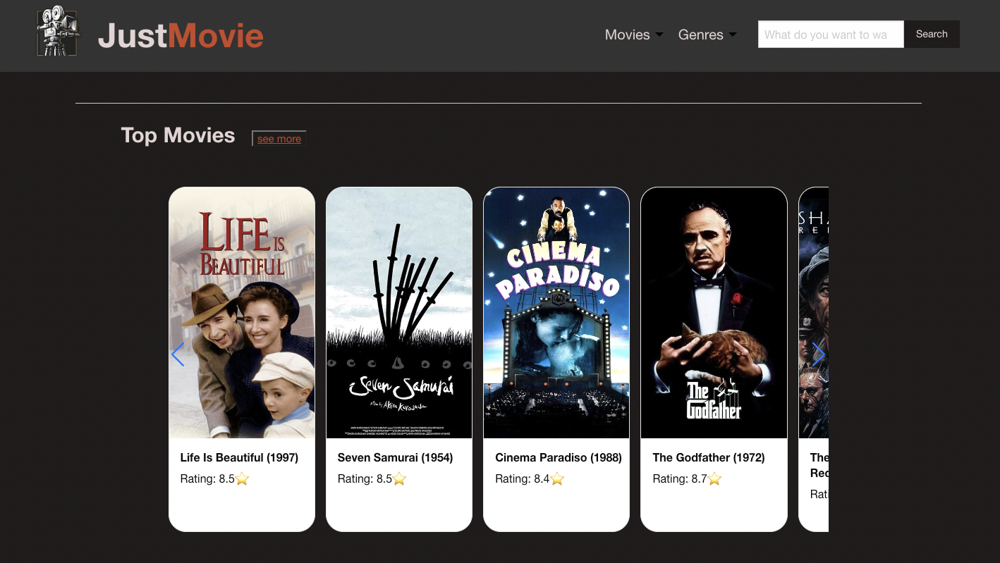
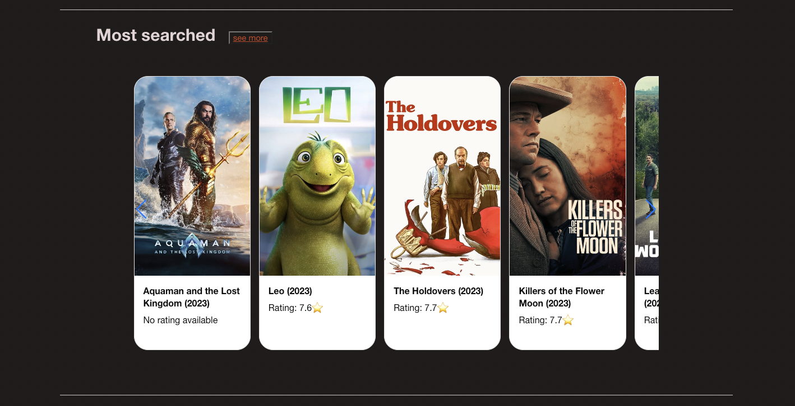
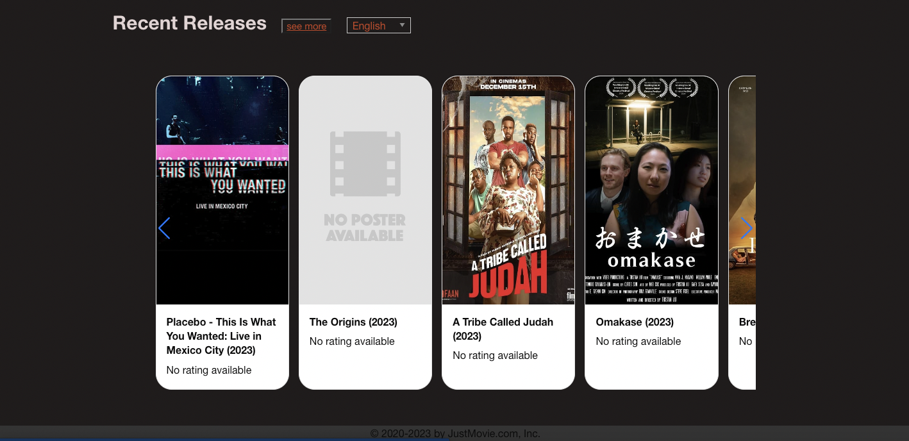
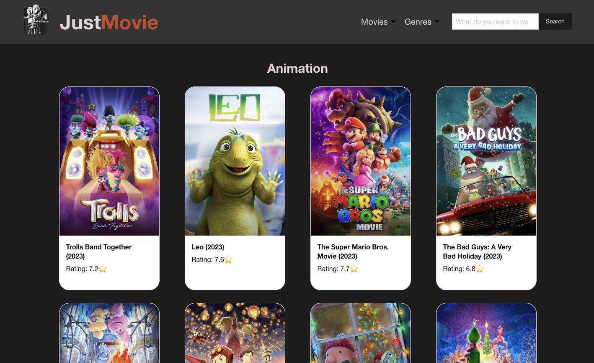
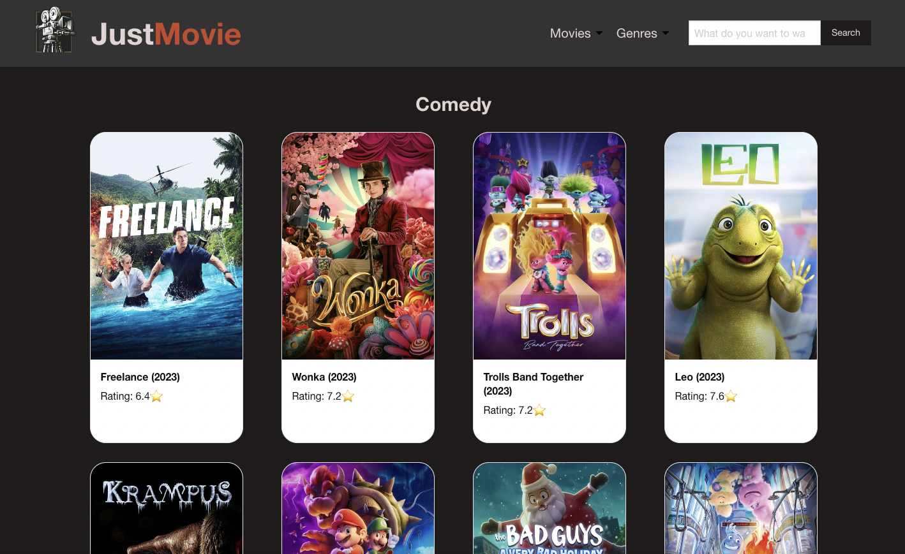
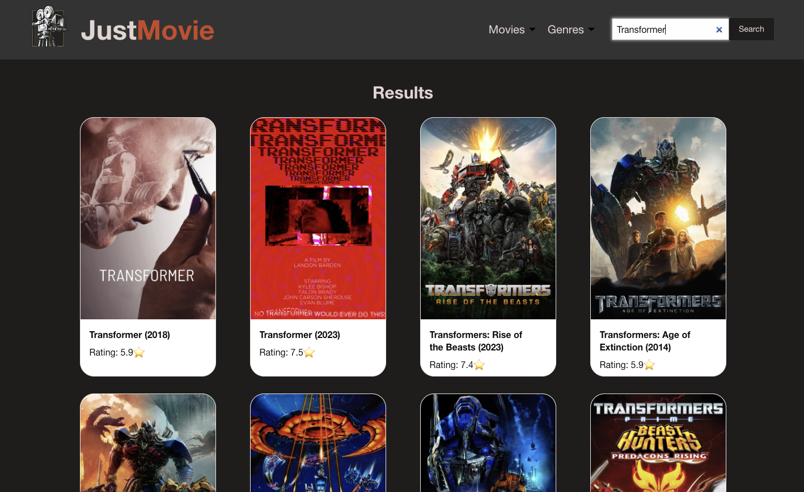
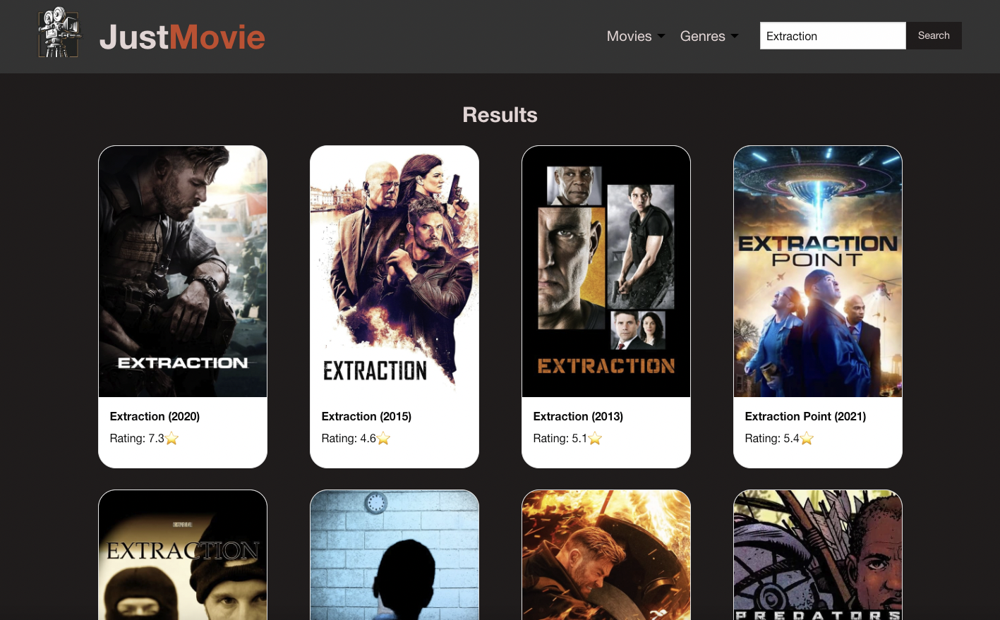
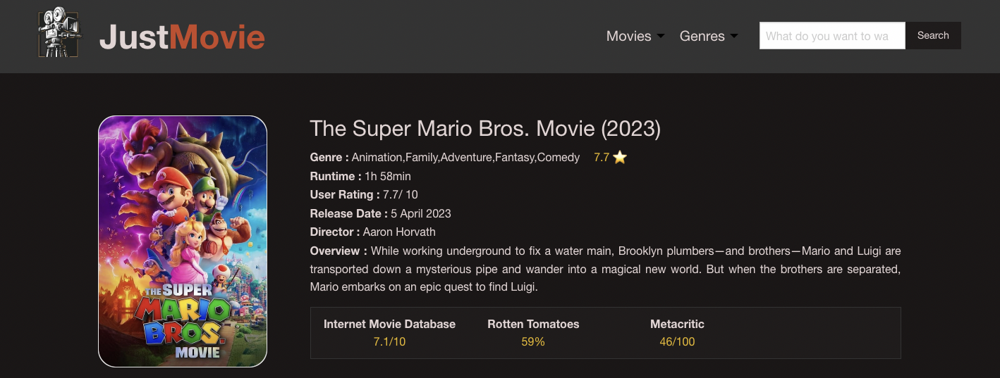
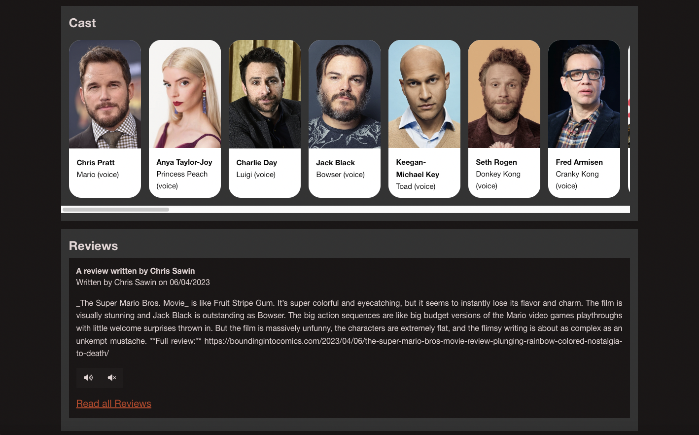
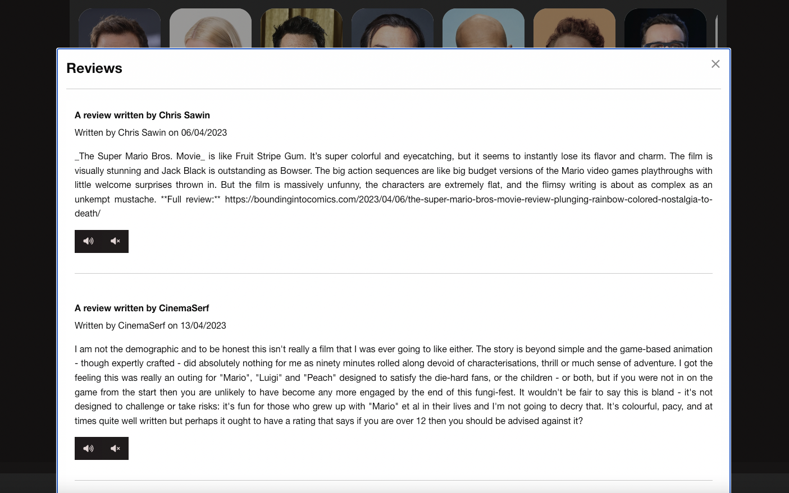

# Just Movie Webpage

## Description

This application builds a website displaying a range of movies in conjunction with their ratings and reviews, enabling users to search for movies by title or through a series of categories including genre. On the home page, these movies are categorised into top rated, most searched and recent releases. In addition to movie ratings from different movie sites, the displayed movie details include title, genre, runtime, director, release date, user rating, overview and cast. Further, the user is able to read the displayed reviews or, through the accessibility voice feature, they are able to listen to the reviews instead.This app will run in the browser and feature dynamically updated HTML and CSS powered by jQuery.

## Installation

N/A

## Usage

- The user is presented with the home page when the application is opened. The home page contains a menu and search bar at the top and 3 sections below where the movies are displayed in top rated, most searched and recent releases categories in three different sliders.The user can see movie titles, release year and user rating in all the 3 sections along with posters.
- When we click on submenu containing movie categories then it displays movies in the selected category with pagination. Upon clicking the 'Genre' link in the menu, a page is opened with the movies which come under that genre.
- Using the search bar provided at the top of the page the user can search for a movie and the search results are displayed. When user clicks the search bar then it displays stored recent searches.
- When user click on see more button on home page then it shows all the movies related to that specified category.
- The user is redirected to movie details page upon clicking a movie title or poster. The details page includes the poster and the movie details such as title, genre, run time, user rating, release date, director, overview and user ratings from different sites (Internet movie database, Rotten tomatoes and Metacritic) in the top section. Then comes the cast section which includes their photos, name and the character they played. The bottom section shows the first review, buttons to start and stop the text voice reader and a link to display more reviews.
- When the user clicks on the buttons then the speech will be started reading the reviews or stopped according to which button is clicked. When the link is clicked to read all reviews, then a modal opens which shows all the reviews for that movie along with play and stop buttons.

#### Link to website :

https://sakshiarora04.github.io/just-movie/

The following images show the web application's appearance and functionality :

- Just Movie
  
- Homepage
  
  
  
  
- Submenu
  
- Search by Genre
  
  
- Search by Title
  
  
  
- Moviedetails
  
  
  
  

## Credits

#### Collaborators

- <a href="https://github.com/shimna-puthanayil">Shimna Puthanayil</a>
- <a href="https://github.com/sakshiarora04">Sakshi Arora </a>
- <a href="https://github.com/Andysu7117">Andy Sue </a>

#### References

https://stackoverflow.com/questions/3239598/how-can-i-get-the-id-of-an-element-using-jquery

https://developer.mozilla.org/en-US/docs/Web/JavaScript/Reference/Global_Objects/String/substring

https://codepen.io/dipsichawan/pen/poyxxVY

https://stackoverflow.com/questions/18722464/swiper-jquery-slider

## Features

- Search function(by title,category)
- Movie details page
- Voice feature using ResponsiveVoice API

## Technologies

- HTML & CSS
- jQuery
- Foundation framework
- Swiper-JS library
- TMDb API
- OMDb API
- ResponsiveVoice API
- Day.js
- jqueryUI
